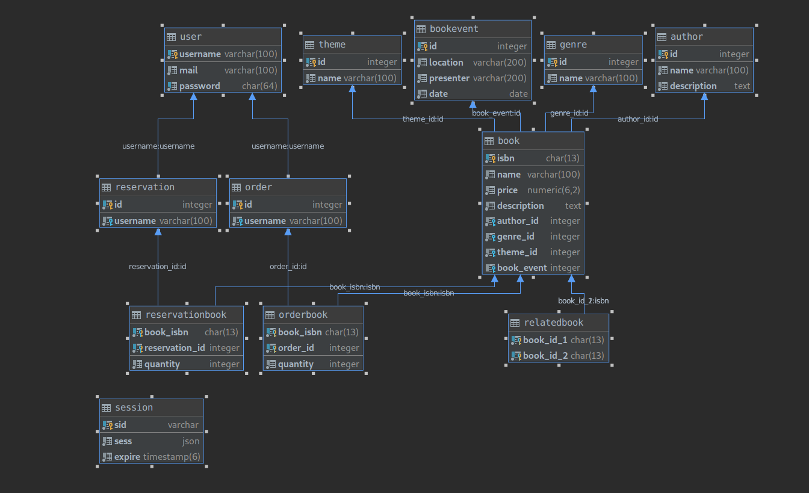

# Documentation of the Backend part

> Deliverable D1

## General group information

| Member n. | Role | First name | Last Name | Matricola | Email address |
| --------- | ------------- | ---------- | --------- | --------- | --------------- |
| 1 | Backend | Francesco | Guardiani | 867616 | francesco.guardiani@mail.polimi.it |
| 2 | Frontend | Miranda | Mucignat | 846693 | miranda.mucignat@mail.polimi.it |

## Links to other deliverables

- Deliverable D0: the web application is accessible at
[this address](https://hyp-2019-library.herokuapp.com).
- Deliverable D2: the YAML or JSON file containing the specification of the app
API can be found at [this address](https://hyp-2019-library.herokuapp.com/backend/spec.yaml).
- Deliverable D3: the SwaggerUI page of the same API is available at
[this address](https://hyp-2019-library.herokuapp.com/backend/swaggerui).
- Deliverable D4: the source code of D0 is available as a zip file at
[this address](https://hyp-2019-library.herokuapp.com/backend/app.zip).
- Deliverable D5: the address of the online source control repository is
available [this address](https://github.com/slinkydeveloper/hyp-2019-web-library). We hereby declare that this
is a private repository and, upon request, we will give access to the
instructors.

## Specification

### Web Architecture

[](architecture.puml ':include :type=code plantuml')

The data layer is implemented though the `PostgreSQL` database, where a database called `library` contains the application data and the session store.
The application layer is implemented through the backend software, where the business logic inhabit. This component exposes a REST API (under the endpoint `/api`) to enable the interaction with frontend
The presentation layer is implemented through the frontend component. This component contains the logic to load asynchronously data from the REST API and render the web pages on client side

### API

#### REST compliance

Describe here to what extent did you follow REST principles and what are the
reasons for which you might have decided to diverge. Note, you must not describe
the whole API here, just the design decisions.

#### OpenAPI Resource models

I introduced the following models:

* `User`
* `Genre`
* `Theme`
* `BookEvent`
* `Author`
* `Book`
* `BookQuantitiesMap` (model used both for create operations of `Order` and `Reservation`)

Using the JSON Schema `$ref` mechanism, I defined some _expanded_ models that contains related entities:

* `Book` → `ExpandedBook` (contains related `Author`, `Theme`, `Genre`, `BookEvent` and related books)
* `BookEvent` → `ExpandedBookEvent` (contains related `Book`)
* `ExpandedOrder`, `ExpandedReservation` (they don't have a not expanded version, includes book information)

These expanded models are used in operations that return a single resource (e.g. `getBook`)

There are also 2 models for login/registration phase:

* `RegisterCredentials`
* `LoginCredentials`

### Data model



Most of those relations map seamlessly to REST resources, but there are few considerations:

* The _expanded_ resources don't live on the DB, they are the result of joined queries.
* `user(password)` contains (of course) the SHA512 hash of the password
* `relatedbook` is a one way relationship. That means that A is related to B, but not necessarily B is related to A
* `Author`, `Genre` and `Theme` are required associations for the `Book`, while `BookEvent` is optional
* `BookQuantitiesMap` maps to `orderbook`/`reservationbook` table
* For simplicity `session` table resides in the same db of the library. However, in a production enviroment, It should live in another db

You can find the SQL required to create the database schema in `/sql/1-init.sql` folder and the ORM models under `/models/definition` folder

## Implementation

### Tools used

The technology stack is composed by:

* `Javascript` on `NodeJS` runtime
* `Postgres` RDBMS
* Vanilla `Javascript` on frontend

For the backend component we used:

* `express`: popular web framework to define and handle web server endpoints
* `cors`: Express module to manage CORS handlers
* `morgan`: Express module for logging
* `express-session` & `connect-pg-simple`: Express modules to manage HTTP Sessions and Session store with Postgres
* `express-openapi-validate`: Express module to automatically validate requests observing the API contract
* `lodash`: Popular JS utility library
* `sequelize` & `pg`: SQL ORM and Postgres driver

For the frontend component we configured a packaging phase using `webpack` with `babel` transpiling

### Environments

The testing environment uses Docker compose, a famous orchestrator to manage simple Docker container compositions. My composition brings up Postgres and PGAdmin.

The production environment is hosted on Heroku. They provide a ready to use Postgres database and a NodeJS environment

### Project structure

```
.
├── backend_public # Public directory to host /backend directory
├── config # Configuration files
├── dist # Public transpiled & minified
├── models # ORM Models
├── paths # API endpoints
├── public # Frontend src
├── received_contacts # Received JSON in contact form
├── sql # SQL files
├── utils # Backend utils

```

### Discussion

> How did you make sure your web application adheres to the provided OpenAPI
specification?

We strictly followed the API Contract Driven Development: We first designed the contract and then we implemented the API.
I also used a module called `express-openapi-validate` that performs the requests validation following the Contract

> Why do you think your web application adheres to common practices to partition
the web application (static assets vs. application data)

The application strictly separate the frontend from the backend components and they communicate only through the REST API.
The source of backend is placed in project root, while the source of frontend is placed under `/public` directory

> Describe synthetically why and how did you manage session state, what are the
state change triggering actions (e.g., POST to login etc..).

The session handler provided by `express-session` creates a new session every time a new host connects to an endpoint under `/api`.
However, after a user logs or registers successfully, the `username` is persisted in the session.
Operations `getUser`, `getOrder`, `createOrder`, `getReservation`, `createReservation` are protected: a user must be logged to access to these.
To check if a user is logged, an handler defined in `/utils/logged_check.js` module checks if the session contains the `username` field.

> Which technology did you use (relational or a no-SQL database) for managing the data model?

We used a relation database called PostgreSQL.
The relation model fits good in a project were you have to manage various associations between different models

## Other information

### Task assignment

- Francesco Guardiani & Miranda Mucignat worked together at the same time on the API Contract
- Francesco Guardiani worked 100% on backend/db component and deploy
- Miranda Mucignat worked 100% on frontend component

### Analysis of existing API

My inspiration to design the API came from 2 important figures of APIs industry: [Arnaud Lauret](https://apihandyman.io/) and [Kin Lane](https://apievangelist.com/).
In their blogs they talk about everyday API design problems and mistakes.
In particular Arnaud maintains an interesting tool called [API Stylebook](http://apistylebook.com/), a website that collects API design guidelines from different companies with [indexed topics](http://apistylebook.com/design/topics/#api-design).

### Learning outcome

All members of the team learnt how to design and document a usable and meaningful REST API.

Francesco learnt:
 
* How to implement the API following a contract
* How to use an ORM to create complex queries and map database tables to ORM models
* How to implement AuthN/Z using session